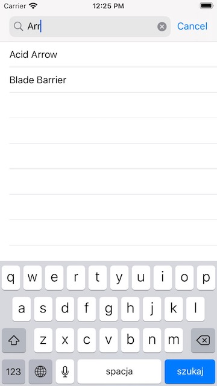

# DungeonsDragons-guide
IOS app written in Swift and UIKit. Its a collection of monsters, races, spells and equipment from Dungeons & Dragons world. Based on [D&D 5th Edition API](https://www.dnd5eapi.co/). 

# Used tools
* `Lottie Animation` - Animated dice as a splash screen(Animation from LottieFiles thanks to [Silicon](https://lottiefiles.com/18184-touzidice6)).
* `Google Customsearch` - This extention can be used to get images from Google in a runtime. Originally there are no images in D&D API.  
* `CocoaPods-keys` - This tool allows per-user config settings to be stored securely in the developer's keychain.

# Screnshots
    

